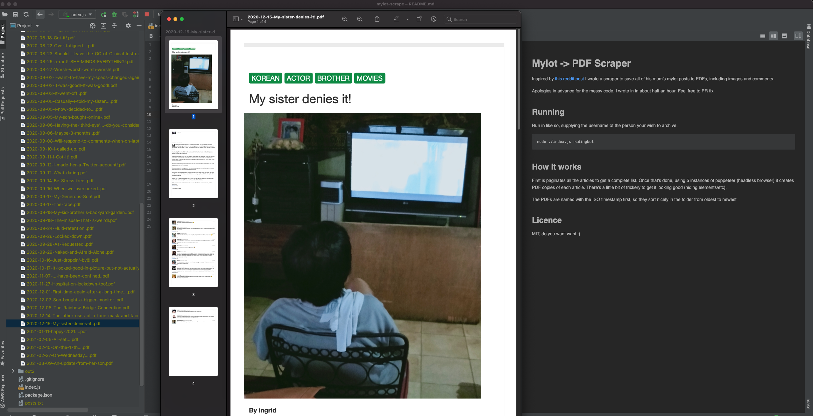

# Mylot -> PDF Scraper

Inspired by [this reddit post](https://www.reddit.com/r/DataHoarder/comments/m3c0c2/my_mother_just_passed_away_she_wrote_extensively/) I wrote a scraper to save all of his mum's mylot posts to PDFs, including images and comments.

Apologies in advance for the messy code, I wrote it in about half an hour. Feel free to PR fix.




## Running

Run in like so, supplying the username of the person your wish to archive.

```bash
node ./index.js ridingbet 
```

## How it works

First is paginates all the articles to get a complete list. Once that's done, using 5 instances of puppeteer (headless browser) it creates PDF copies of each article. There's a little bit of trickery to get it looking good (hiding elements/etc).

The PDFs are named with the ISO timestamp first, so they sort nicely in the folder from oldest to newest

## Licence

MIT, do you want want :)
